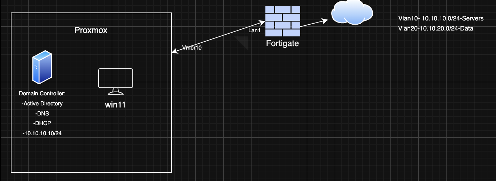

# Lab 01

---

## Objective
Set up a basic lab including the following components:

- Proxmox running on a mini PC
- Windows Server 2025 VM
- Windows 11 client VM
- FortiGate 60F firewall

This lab will be expanded in the future (e.g., integrating a switch and access point) to practice additional networking technologies.

---

## Topology

topology.png)

---

## Proxmox Setup

- Created a new virtual bridge on Proxmox: `vmbr10`

  bridge_setup.png)

- SSH’d into Proxmox and created a backup of `/etc/network/interfaces` using `cp` (for rollback if needed)

  network-interface-backup.png)

- Bound `vmbr10` to the physical Ethernet interface
- Enabled **VLAN-aware** mode
- Added VLANs **10, 20, and 30**
- Applied changes

---

## Windows Server 2025 Setup

- Changed computer name to `GoT-SRV-01` and rebooted
- Configured network settings as shown below:

  network-settings.png)

- Installed the following roles and rebooted:
  - Active Directory Domain Services
  - DNS Server
  - DHCP Server

- Promoted the server:
  - Selected **Add a new forest**
  - Root domain name: `GoT.local`
  - Rebooted after promotion

  server-settings.png)

### Active Directory Configuration

- Opened **Active Directory Users and Computers**
- Under `GoT.local`, created a new OU named **Starks**
- Inside the **Starks** OU:
  - Created a user: **Ned Stark**
  - Created two groups: **Male** and **Female**

  OU-creation.png)

### DHCP Configuration

- Opened **DHCP Management Console**
- Authorized the DHCP server
- Created a new IPv4 scope:
  - Range: `10.10.10.100 – 10.10.10.200`
  - Scope options:
    - **003 Router**: `10.10.10.1`
    - **006 DNS Server**: `10.10.10.10`

- Created two additional IPv4 scopes for different VLANs:

  DHCP-Scope-creation.png)
  DHCP-VLAN10-01.png)
  DHCP-VLAN10-02.png)
  DHCP-VLAN20-01.png)
  DHCP-VLAN20-02.png)

- Both scopes use the same IP range
- Default gateway differs per scope to reflect different VLANs

---

## Windows 11 Client Setup

- Configured the Windows 11 VM network adapter:
  - Bridge: `vmbr10`
  - VLAN tag: **20**

- Started the VM and verified DHCP assignment using:

  ipconfig.png)

- Tested connectivity using:
  - `ping` (IP and DNS)

- Joined the domain:
  - Opened **System Properties** (`sysdm.cpl`)
  - Changed membership to domain: `GoT.local`
  - Authenticated using domain admin credentials
  - Rebooted as required

- Logged in using **Ned Stark**
- Confirmed the VM successfully joined the domain

  WM-CLIENT-VLAN20.png)

---

## FortiGate 60F Setup

### VLAN Sub-Interfaces (port1)

| VLAN ID | IP Address   | Subnet Mask     |
|-------:|--------------|-----------------|
| 10     | 10.10.10.1   | 255.255.255.0   |
| 20     | 10.10.20.1   | 255.255.255.0   |

- Enabled administrative access:
  - Ping
  - HTTP
  - HTTPS
  - SSH

- Created firewall policy:
  - Source: `10.10.10.0/24`
  - Destination: Internet
  - Outgoing interface: `wan1`
  - NAT enabled

- Connected `wan1` to the home router
- IP information obtained via DHCP

  dhcp_relay.png)

---

## Notes / Next Steps

- Integrate a managed switch with VLAN trunking
- Add a wireless access point
- Implement inter-VLAN firewall policies
- Test DHCP relay vs local scopes

