# Lab 03 – Linux Server Deployment & Hardening

---

## Objective

This lab is the initial setup of a Linux server which will be used for both the existing home-lab setup (proxmox + networking) and learning purposes for linux.
  
Tasks covered:

- Manual static network configuration
- Network troubleshooting and validation
- OpenSSH installation and hardening
- Firewall configuration with UFW
- User and group management

---

## Topology

The Linux VM is connected to **VLAN 55 (10.10.55.0/24)**.  
Connectivity and routing are tested to the gateway and external internet.

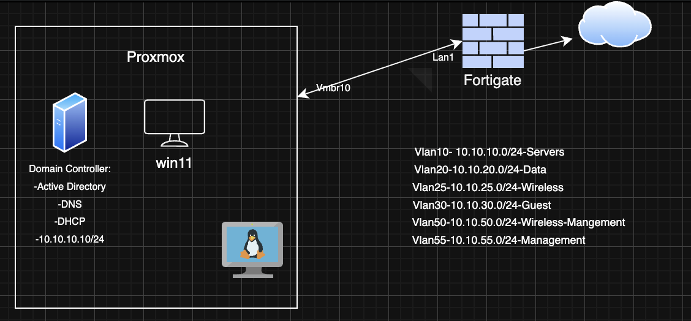

---

##  Manual Static Networking

Initially, the VM had no IP address as VLAN 55 had no DHCP server (Windows Server was offline at the time). 
 
There was no network configuration file in the '/etc/netplan', therefore a new netplan configuration was created to assign a static IP.
The configuration was applied and verified with 'ip a' and 'ip route'.

Tested connectivity to the default gateway, external network and dns with ping.

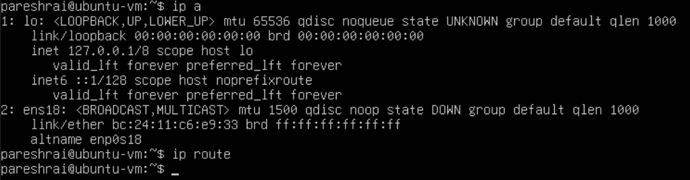
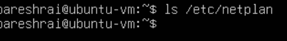
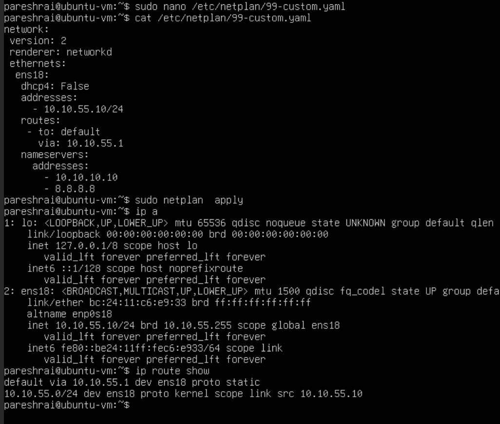
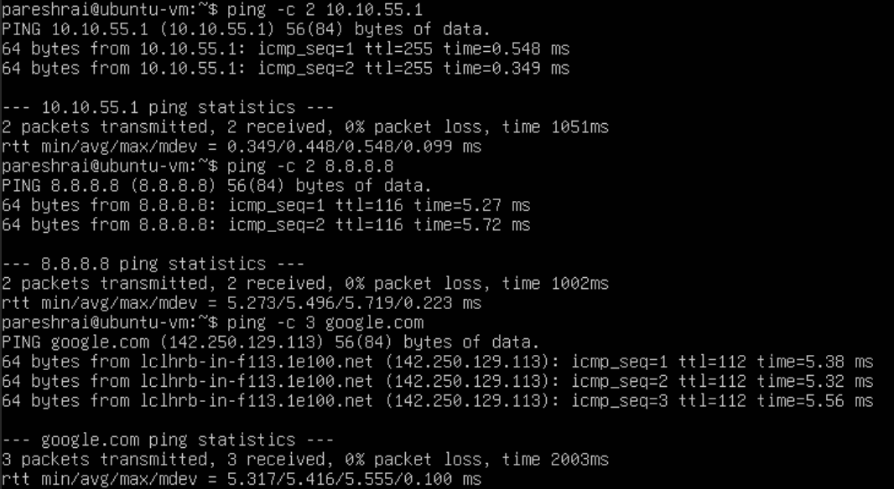

---

## OpenSSH Installation & Hardening

OpenSSH was not installed during VM setup, so it was installed using 'apt' and verified with 'systemctl'.

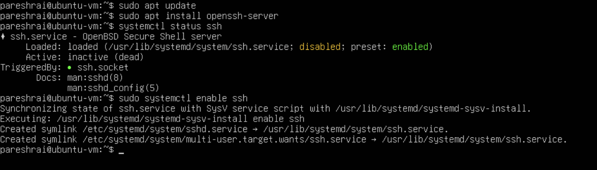

A backup of sshd_config was done before any changes. After changes were made, it was restarted with 'systemctl'. Tested ssh access from another machine in vlan 55.

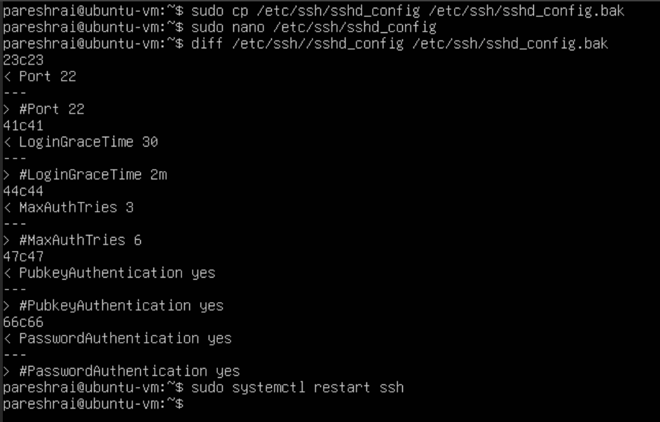
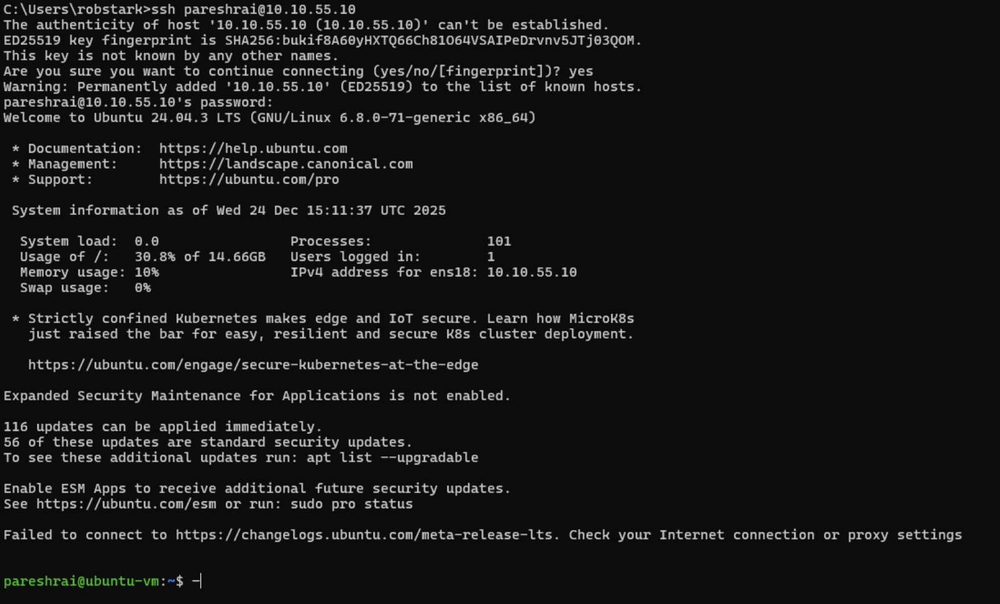

---

## UFW Setup

UFW was initially inactive. It was enabled and configured to allow SSH. Checked the configuration with a test machine.

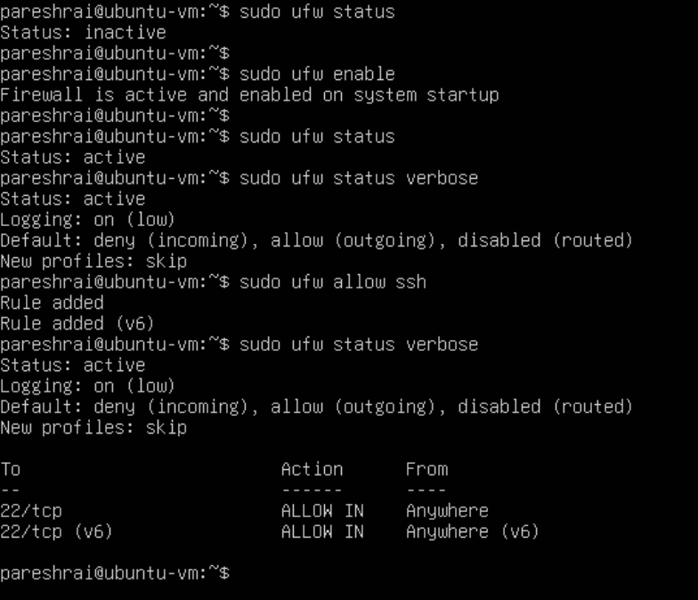
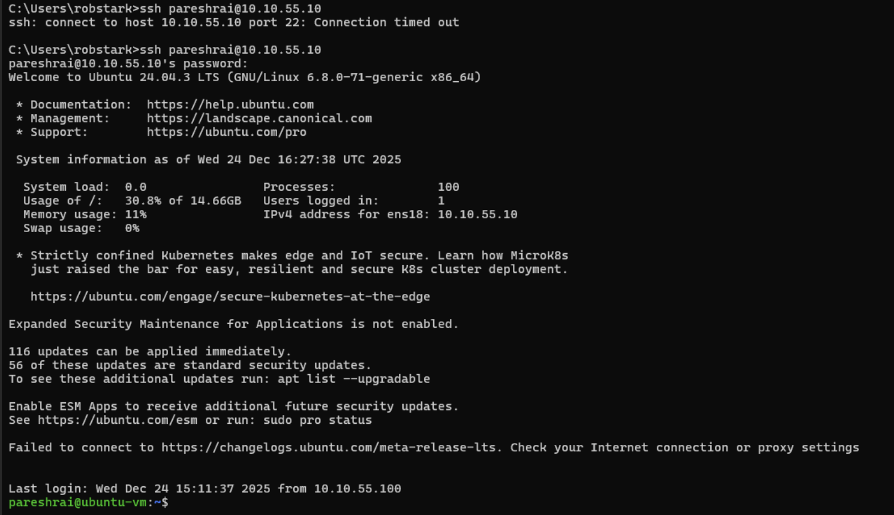

---

## User & Group management

A new user was added and granted administrative privileges by moving to the 'sudo' group.

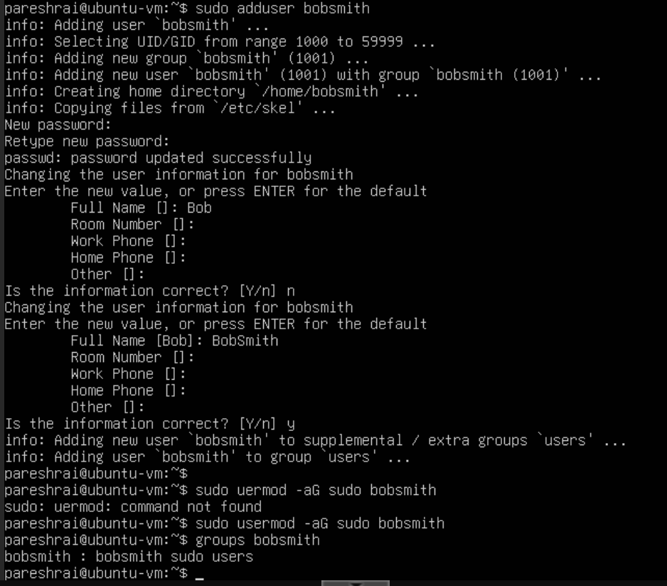

---

## Next steps

- Configure SSH key-based authentication
- Install Fail2ban
