# Lab 04 – Zabbix Monitoring & Alerting

---

## Objective/Overview

Deploy a monitoring solution to monitor and alert for any issues in the homelab. For simplicitiy, I decided not to include the CA, NPS, AP, and use snmpv2 for this setup.

---

## Components Used

- Proxmox (Hypervisor)
- Ubuntu Server VM
- Zabbix 7.0
- Cisco 3750X Switch
- FortiGate Firewall
- Windows Server VM
- Linux Server VM
- External SMTP Relay (Brevo)

---

### Topology

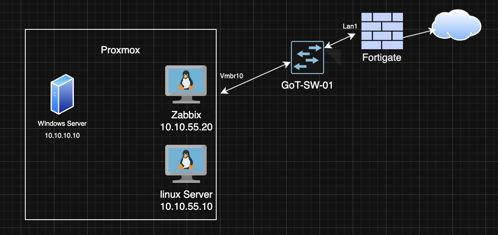

---

### Zabbix Server Installation (Linux)

- Deployed an Ubuntu Server VM on Proxmox
- Added the official **Zabbix 7.0 repositories**
- Installed and configured required services:
  - Apache
  - MySQL
  - PHP
  - Zabbix Server and Frontend
- DBPassword has been blurred for security.
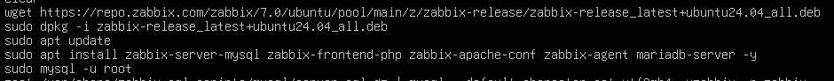
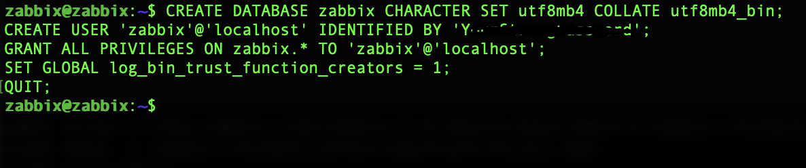
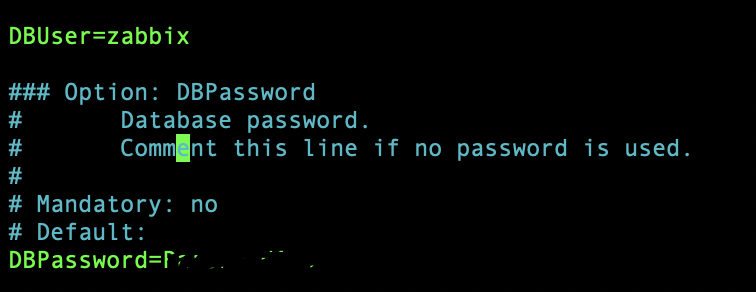
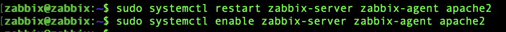

---

### Cisco 3750X Switch

- Configured SNMPv2
- Restricted SNMP access to the Zabbix server using a Standard 
ACL
- Community string has been blurred for security
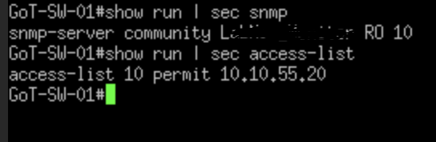

---

### FortiGate Firewall 

- Configured SNMPv2
- Used the default SNMP events
- Community string has been blurred for security
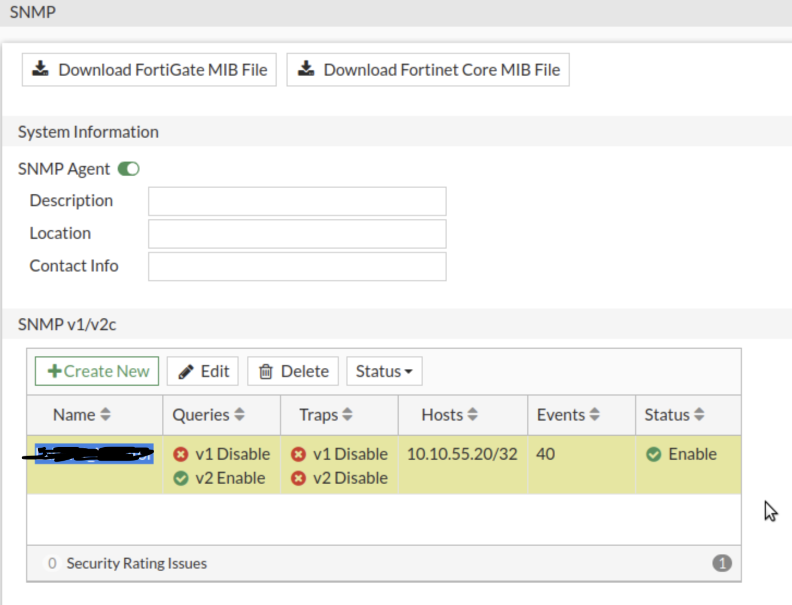
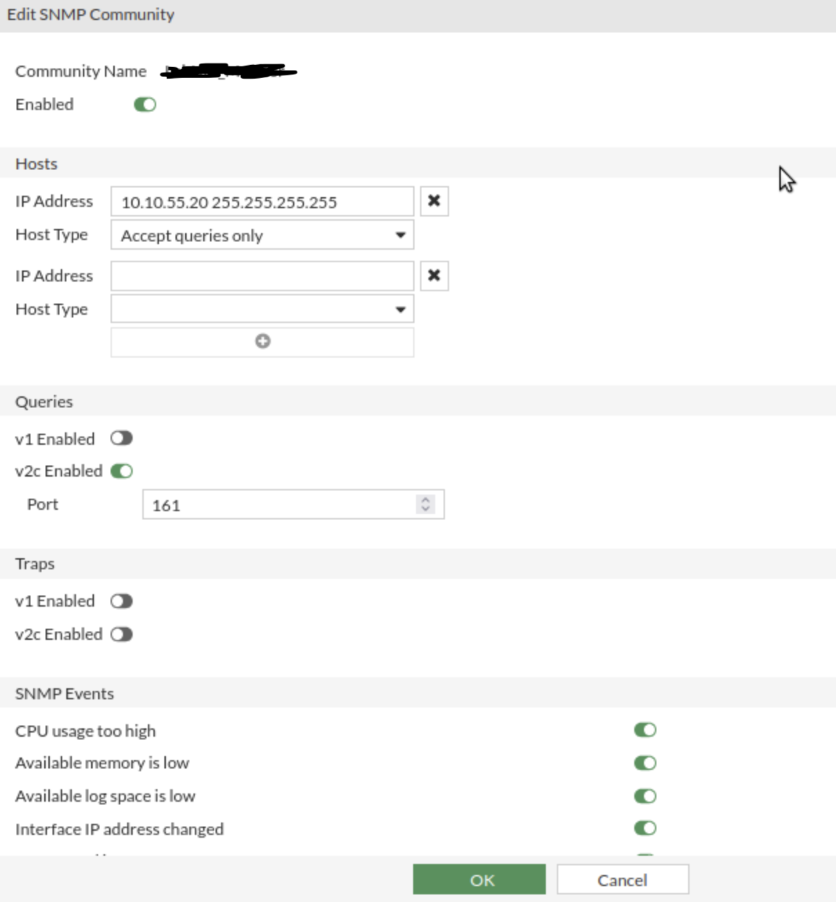 # blur the community_name

---

### Windows Server

- Downloaded Zabbix Agent, and set it up
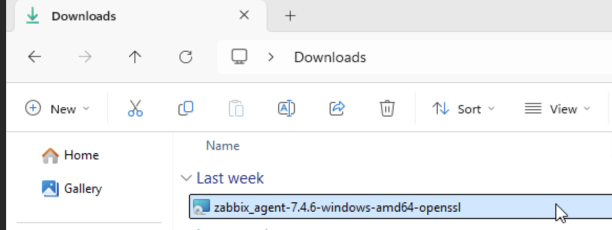
- Forgot to take screenshots during exact set up process, however inlcuded screenshot below of the .conf file
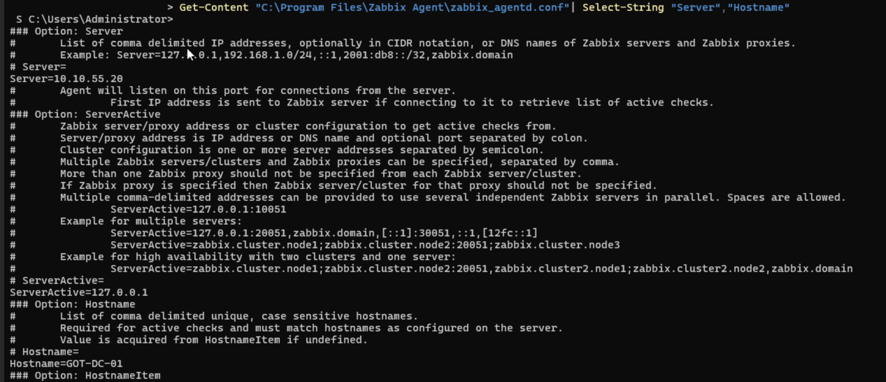

---

### Linux Server
- Installed Zabbix Agent, enabled and started it using systemctl, and added the sever ip and hostname on the .conf file

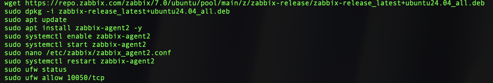
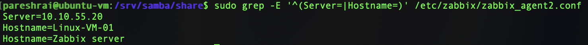

---

### Zabbix WebUI Configuration

- Added each device/vm on via Data collection > hosts > create host
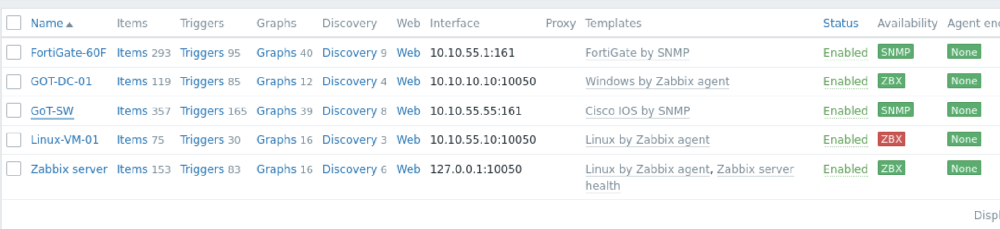
- Selected the matching template for each host
- For Fortigate and the Cisco Switch, they needed the matching community string via the Macros tab, example screenshot below
- Commntiy string has been blurred for security
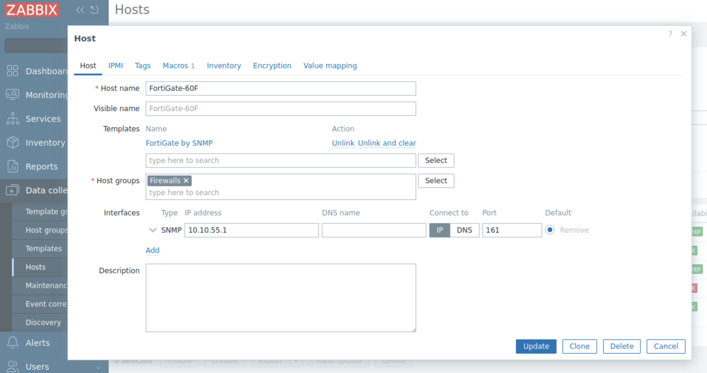
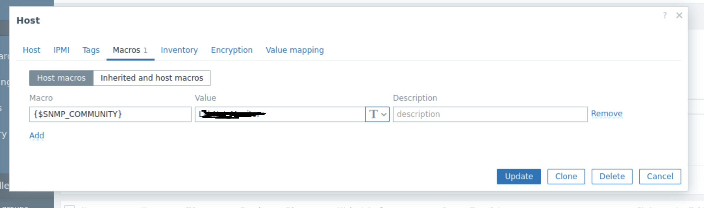

---

## Alerting Configuration 

- Created a new media type via ALerts > Media types > Create edia type
- Created a account with Brevo which will be used as an external SMTP relay - For simpilicty, have not included steps in Brevo
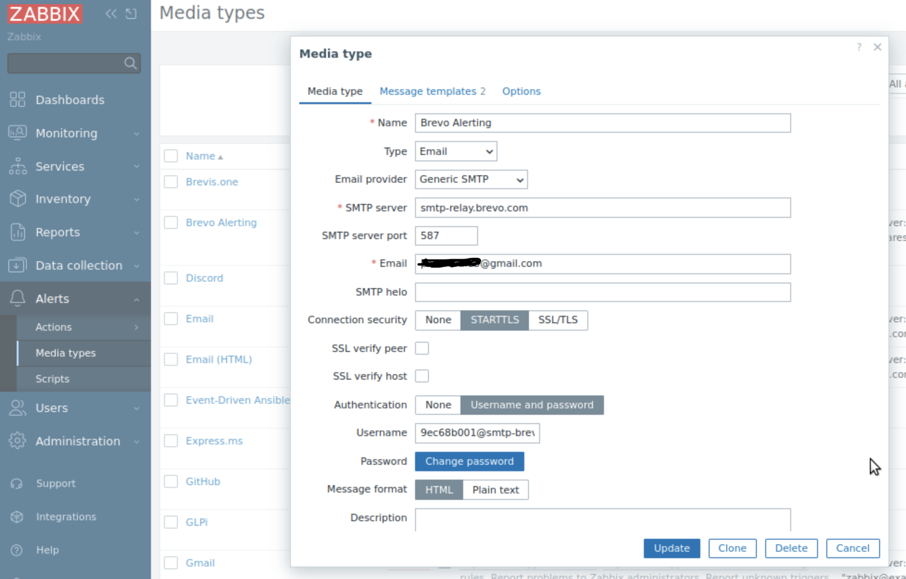
- Created two new message templates, one for a problem e.g interface down, and one for the problem recover e.g Interface back up
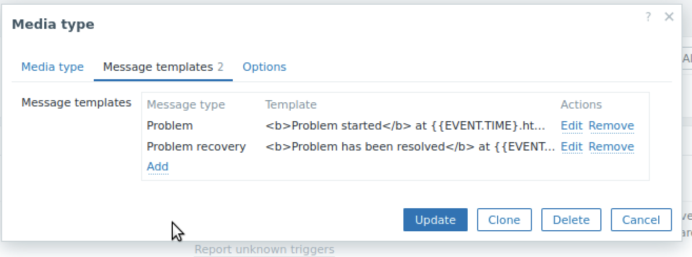

- Configured the admin account to be used for Alerting via Users > Users
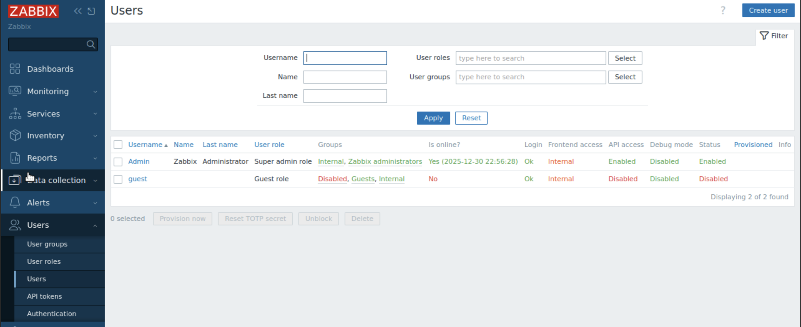
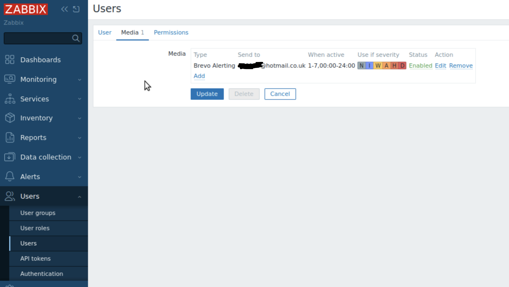
- Created an alert  via ALerts > actions > trigger actions
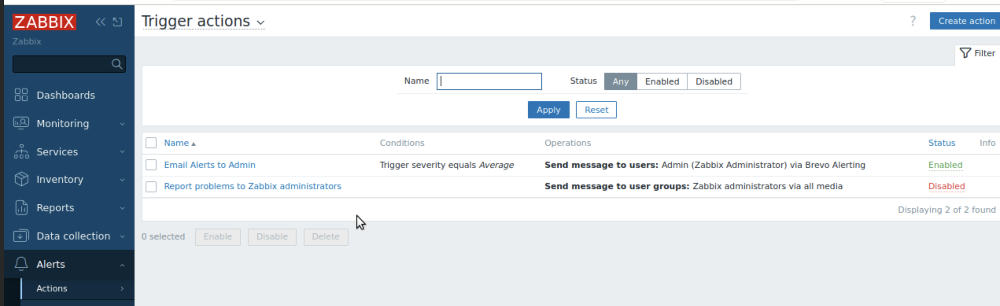
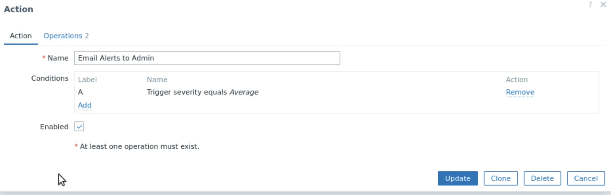
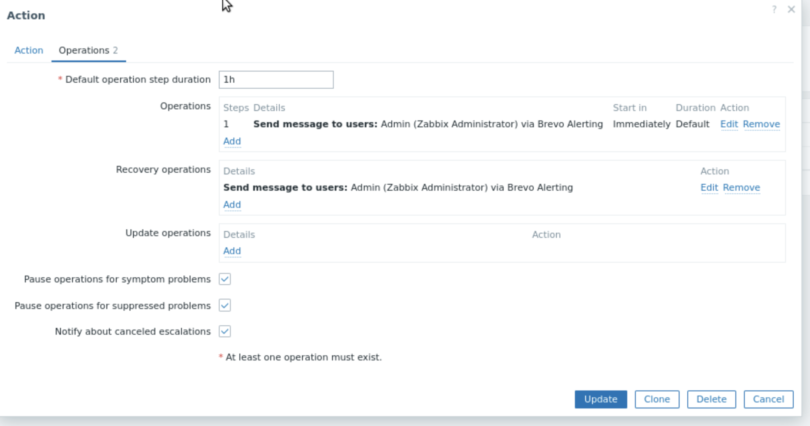

---

## Testing & Validation

- Stimulated failure event via shutdown an interface on the switch
- Received email for the problem and email when problem was resolved
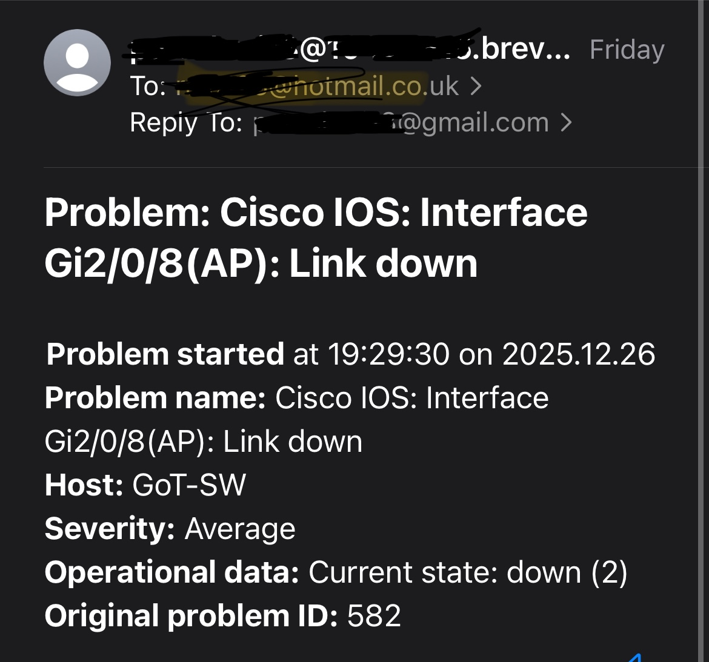
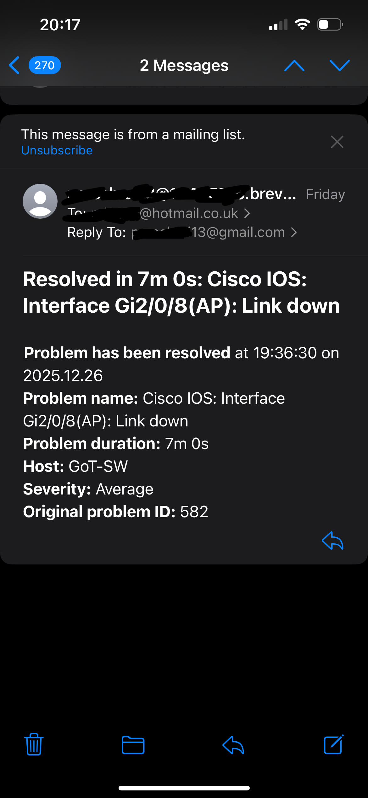

---

## Notes/Next Steps

- Implement SNMP Traps for real time alerts
- Create custom dashboards e.g hosts with highest traffic

---
