# Lab 05 - Backup Server for backup configurations

---

## Objective/Overview

Set up a backup solution for my home lab to backup important configurations:
- Proxmox Virtual machine backups
- Network device configurations (Cisco switch and FortiGate firewall)

To make the document more simple, i have not included full configurations for the NAS as this was already setup before the homelab, and was already in use for other personal tasks like storing media files.

---

## Components Used

- Proxmox
- NAS (Ubuntu Server)
- Ubuntu VM (Ubuntu Server)
- Cisco Switch
- Fortinet Firewall

---

### Topology

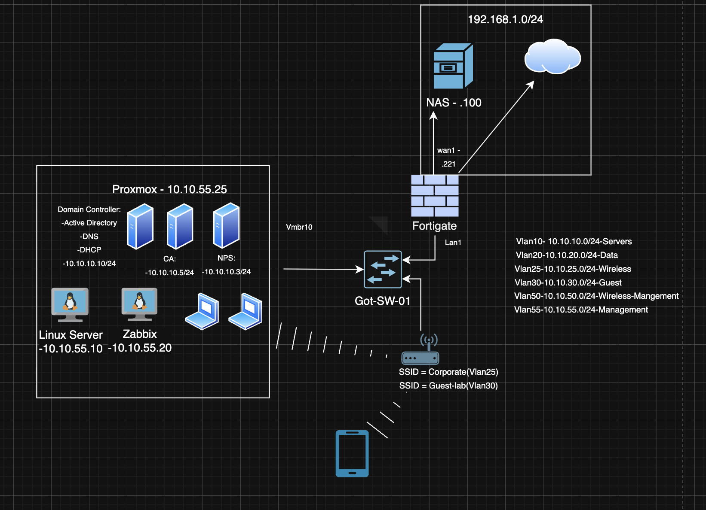

---

### NAS Server setup 

- Deployed Ubuntu Server on Dell OptiPlex 7090 SFF
- Configured RAID1 on two hdds using mdadm
- Created the directory /mnt/storage/backup for centralized backups
- Installed and configured NFS
- Exported backup directories via /etc/exports

---

### Proxmox 

- Setup new storage on proxmox, pointing to the nas
- Setup a backup job on proxmox

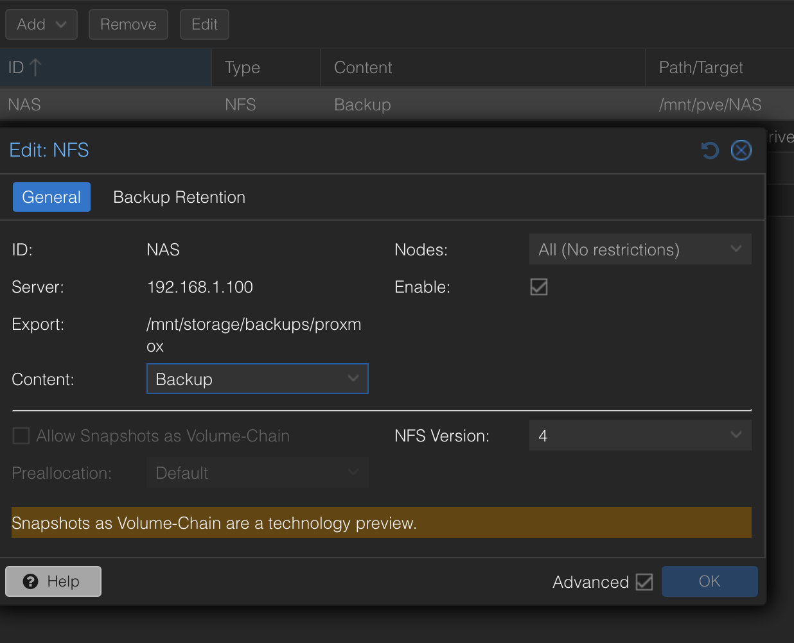
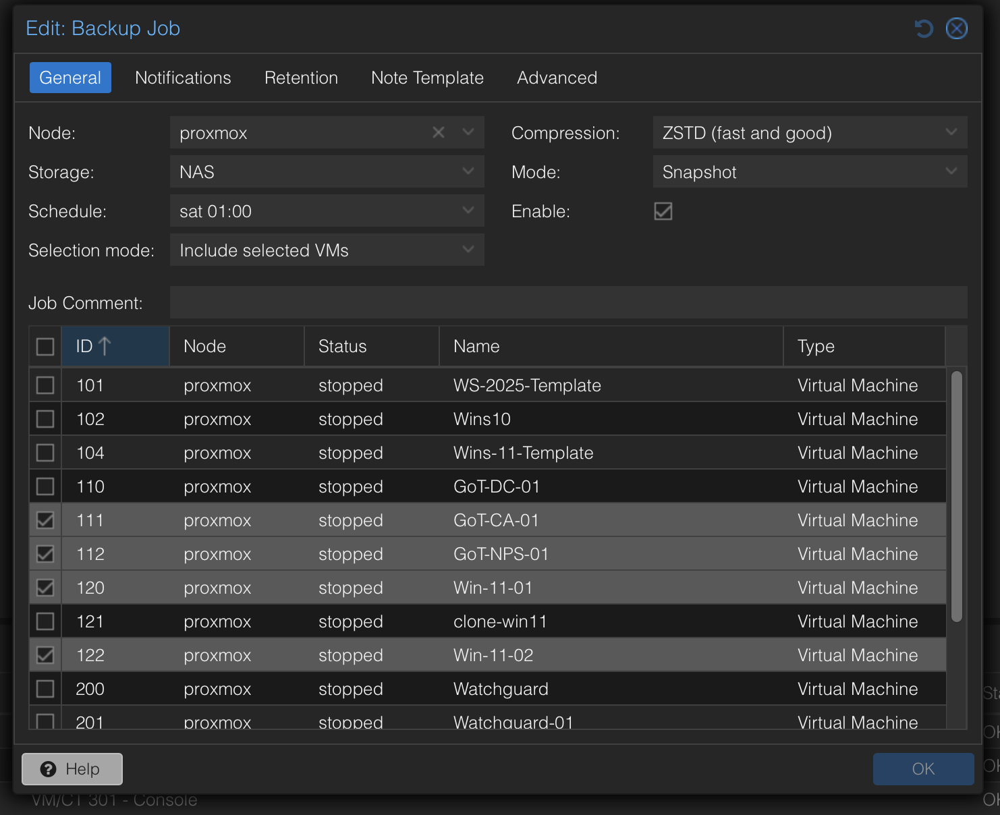

---

### Ubuntu VM

- Installed nfs-common
- Installed python3-pip and venv for virtual environments
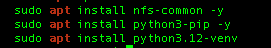
- Setup ssh keys using ssh-keygen

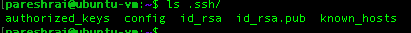
- Created a virtual environment using venv and installed netmiko
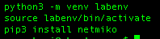
- Created a backup script using python to automate backups
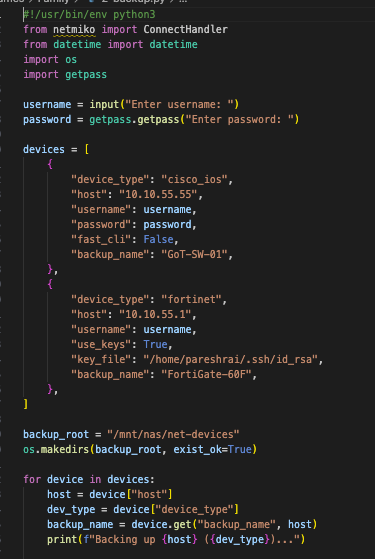
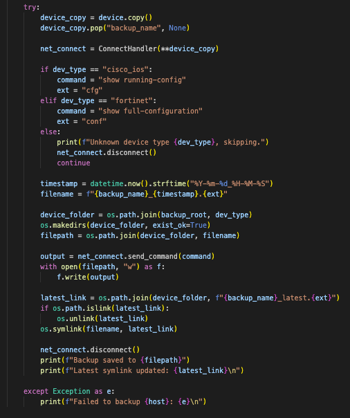
- Created directory for the NAS mount

- Configured automatic mounting of the NAS using /etc/fstab
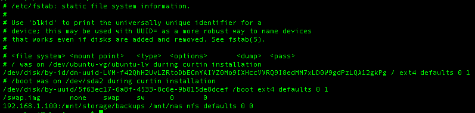

---

### FortiGate Firewall & Cisco 3750 Switch

- Configured key-based authentcation on the FortiGate and Switch

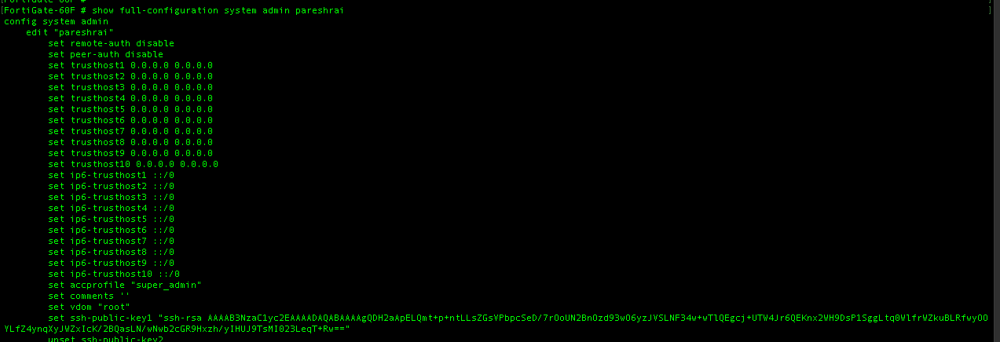

---

### Troubleshooting/Notes

- Cisco 3750 only supported legacy key exchange algorithms and ciphers causing ssh connections to fail
- Created a custom ssh client configuration as a workaround
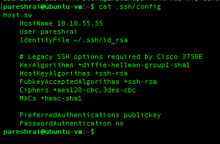
- Whilst ssh key based authentication worked when using ssh directly from the terminal, the python script using netmiko did not
- As a workaround used the input() function and getpass() module for ssh authentication
- Username and password are only requested during script execution and not stored in script
- Proxmox and Ubuntu VM were getting access denied when trying to reach the NAS
- Used tcpdump on NAS to produce a pcap

- Open the pcap on Wireshark and saw that proxmox and ubuntu vm were being nated to the fgfw ip
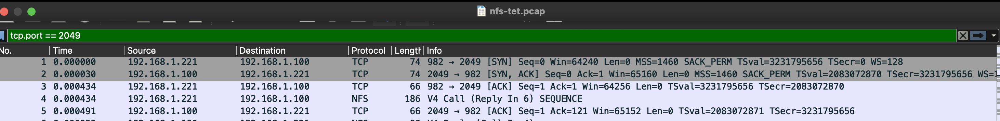
- Added fgfw as a secondary client on the /etc/exports as a temporary workaround which solved the issue
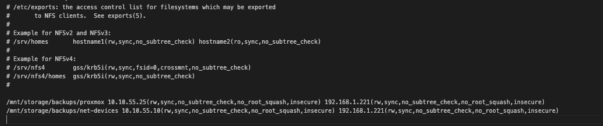
